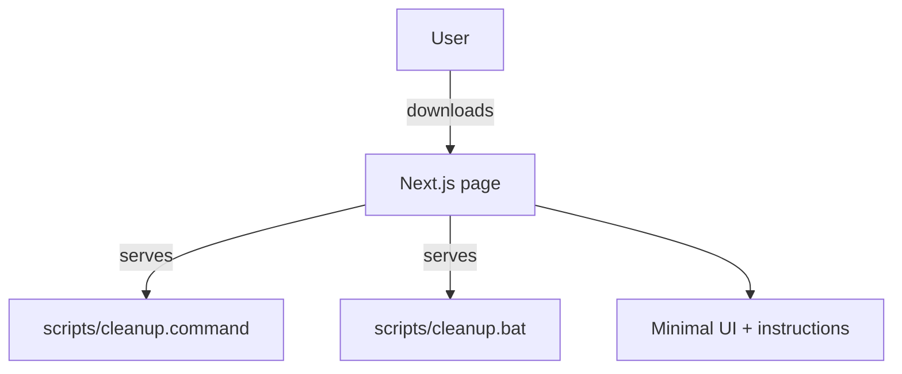
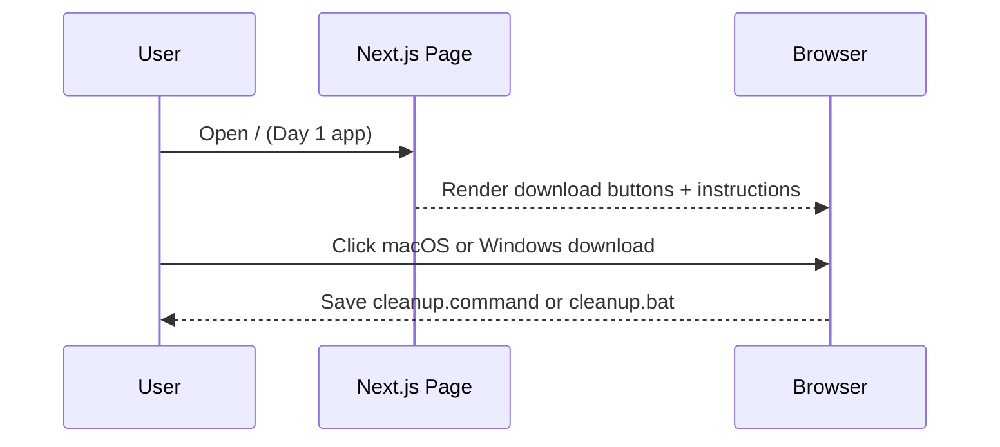

# One-Click Cleanup (Day 1 of 30 Days of Product)

One-click system cleanup scripts for macOS and Windows (downloadable).

## Live demo
- Visit https://lawrencehua.com/30-days-of-product

## Problem & Solution
- **Problem:** Cache/log bloat slows machines; many cleaners are bloated or unsafe.
- **Solution:** A tiny, trustworthy script per OS with a minimal delivery page.

## What’s inside
- Standalone Next.js project.
- Hosts macOS `.command` and Windows `.bat` downloads with usage instructions.
- `.env.example` contains placeholders; fill with your own keys.

## Run locally
1. Install deps: `npm install`
2. Copy `.env.example` to `.env` and provide your values
3. Start dev server: `npm run dev`
4. Open `http://localhost:3000`

## Notes
- For demos, use the live link above.
- Repo name: One-Click Cleanup (Day 1 of 30 Days of Product)

## Architecture

## Sequence

